<!--
  Hi, you're reading the source. That's the right instinct.
  We're hiring developers who do this kind of thing for fun: hi@meui.cz

  Everything below is generated by /scripts in this repo. Edit the scripts,
  not the SVGs. Images use ./relative paths, which in profile/README.md
  resolve to /profile, so nothing goes through GitHub's image proxy.
-->

<a href="https://meui-creative.com">
  <picture>
    <source media="(prefers-color-scheme: dark)" srcset="./assets/hero-dark.svg">
    
  </picture>
</a>

  <b>A studio from Liberec, Czechia.</b> Websites, e-shops, apps, brands, video and campaigns, 
  made by one team under one roof. No templates, no outsourcing, no hand-offs over the wall.

  <a href="https://meui-creative.com"><kbd>&nbsp;meui-creative.com&nbsp;</kbd></a>&nbsp;
  <a href="https://meui-creative.com/projekty"><kbd>&nbsp;portfolio&nbsp;</kbd></a>&nbsp;
  <a href="mailto:hi@meui.cz"><kbd>&nbsp;hi@meui.cz&nbsp;</kbd></a>&nbsp;
  <a href="https://meui-creative.com/press"><kbd>&nbsp;press kit&nbsp;</kbd></a>

 

<picture>
  <source media="(prefers-color-scheme: dark)" srcset="./assets/headings/work-dark.svg">
  
</picture>

<a href="https://vbezovemudoli.cz"><picture><source media="(prefers-color-scheme: dark)" type="image/avif" srcset="./assets/work/bezove-udoli-dark.avif"><source media="(prefers-color-scheme: dark)" type="image/webp" srcset="./assets/work/bezove-udoli-dark.webp"><source type="image/avif" srcset="./assets/work/bezove-udoli-light.avif"><source type="image/webp" srcset="./assets/work/bezove-udoli-light.webp">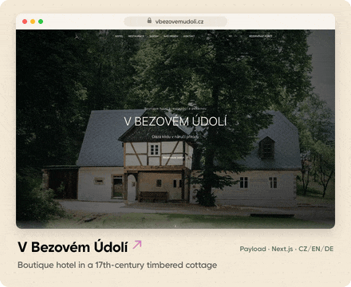</picture></a> <a href="https://events.3mag.eu"><picture><source media="(prefers-color-scheme: dark)" type="image/avif" srcset="./assets/work/3mag-events-dark.avif"><source media="(prefers-color-scheme: dark)" type="image/webp" srcset="./assets/work/3mag-events-dark.webp"><source type="image/avif" srcset="./assets/work/3mag-events-light.avif"><source type="image/webp" srcset="./assets/work/3mag-events-light.webp">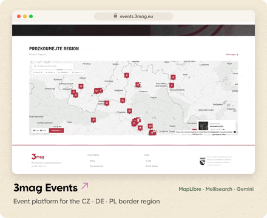</picture></a>

<a href="https://artglass.cz"><picture><source media="(prefers-color-scheme: dark)" type="image/avif" srcset="./assets/work/artglass-dark.avif"><source media="(prefers-color-scheme: dark)" type="image/webp" srcset="./assets/work/artglass-dark.webp"><source type="image/avif" srcset="./assets/work/artglass-light.avif"><source type="image/webp" srcset="./assets/work/artglass-light.webp">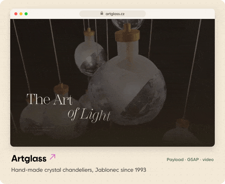</picture></a> <a href="https://masher-store.cz"><picture><source media="(prefers-color-scheme: dark)" type="image/avif" srcset="./assets/work/masher-dark.avif"><source media="(prefers-color-scheme: dark)" type="image/webp" srcset="./assets/work/masher-dark.webp"><source type="image/avif" srcset="./assets/work/masher-light.avif"><source type="image/webp" srcset="./assets/work/masher-light.webp">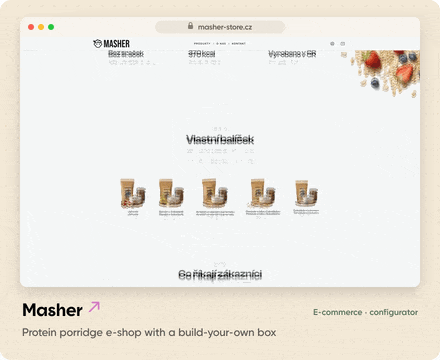</picture></a>

<a href="https://escapeboom.cz"><picture><source media="(prefers-color-scheme: dark)" type="image/avif" srcset="./assets/work/escapeboom-dark.avif"><source media="(prefers-color-scheme: dark)" type="image/webp" srcset="./assets/work/escapeboom-dark.webp"><source type="image/avif" srcset="./assets/work/escapeboom-light.avif"><source type="image/webp" srcset="./assets/work/escapeboom-light.webp">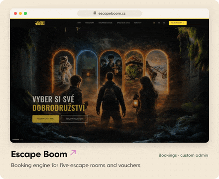</picture></a> <a href="https://bitez.cz"><picture><source media="(prefers-color-scheme: dark)" type="image/avif" srcset="./assets/work/bitez-dark.avif"><source media="(prefers-color-scheme: dark)" type="image/webp" srcset="./assets/work/bitez-dark.webp"><source type="image/avif" srcset="./assets/work/bitez-light.avif"><source type="image/webp" srcset="./assets/work/bitez-light.webp">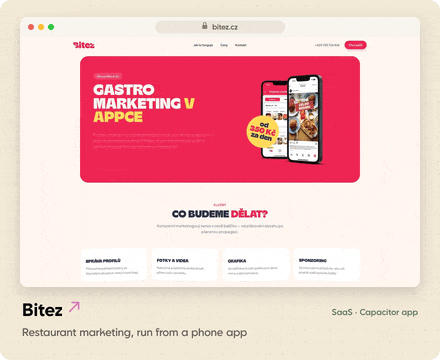</picture></a>

Every clip above is recorded by our own frame-by-frame recorder (Playwright + CDP + ffmpeg), not a screen grab. More at <a href="https://meui-creative.com/projekty">meui-creative.com/projekty</a>.

 

<picture>
  <source media="(prefers-color-scheme: dark)" srcset="./assets/headings/numbers-dark.svg">
  
</picture>

<picture>
  <source media="(prefers-color-scheme: dark)" srcset="./assets/numbers-dark.svg">
  
</picture>

  

<picture>
  <source media="(prefers-color-scheme: dark)" srcset="./assets/headings/products-dark.svg">
  
</picture>

<picture>
  <source media="(prefers-color-scheme: dark)" srcset="./assets/products-dark.svg">
  
</picture>

Half of what we build is for clients. The other half exists because we wanted it to.

- **[Fixuj & Mixuj](https://fixujamixuj.cz)**: drink deals from ten Czech chains, scraped three times a day, with a 14-day price forecast from a Chronos-2 model. Web plus iOS and Android.
- **[Bombotalk](https://bombotalk.cz)**: a satirical daily. Every morning a Claude Code routine writes the issue through the site's own MCP server, and a risk gate decides what gets published.
- **[Froggies](https://froggies.meui.cz)**: a leapfrog race around a lake for 2–4 players. PixiJS, bots, online rooms, and a streamed soundtrack.
- **[^peak](https://peak.meui.cz)**: an evidence-based biohacking encyclopedia, on the App Store.
- **[Cue](https://cue.meui.cz)**, **[Hodinky Pro Vás](https://hodinkyprovas.cz)**, **Stěhuj se** and **[AAC](https://anonymous-alcoholic-club.com)**: film pre-production, a watch configurator, an open-data map of where to move (a hackathon build), and our own streetwear label.

 

<picture>
  <source media="(prefers-color-scheme: dark)" srcset="./assets/headings/stack-dark.svg">
  
</picture>

<picture>
  <source media="(prefers-color-scheme: dark)" srcset="./assets/terminal-dark.svg">
  
</picture>

**Default stack:** Next.js, TypeScript, Payload CMS, Tailwind and GSAP, on PostgreSQL or MongoDB, built with Bun. Mobile apps through Capacitor. Everything we host runs on our own Hetzner machines through Coolify, so clients own their code and nobody gets a surprise serverless bill.

We publish a few pieces as packages: `@meui-creative/cookies` (consent bar with Consent Mode v2), `@meui-creative/meter` and `@meui-creative/payload-redis-cache`.

 

<picture>
  <source media="(prefers-color-scheme: dark)" srcset="./assets/headings/team-dark.svg">
  
</picture>

<picture>
  <source media="(prefers-color-scheme: dark)" srcset="./assets/team-dark.svg">
  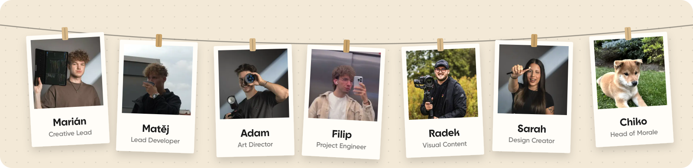
</picture>

It started in 2021 as two friends from Liberec freelancing on either side of the same project, one in design, one in code. No business plan, no investor. The studio became official in 2024 and has been growing since.

> [!TIP]
> **We're hiring.** Frontend or full-stack developers who like Next.js, TypeScript and GSAP, and a social media specialist. Part-time or contract. [See the roles](https://meui-creative.com/o-nas) or just write to [hi@meui.cz](mailto:hi@meui.cz).

 

<a href="mailto:hi@meui.cz">
  <picture>
    <source media="(prefers-color-scheme: dark)" srcset="./assets/footer-dark.svg">
    
  </picture>
</a>

  <a href="https://meui-creative.com">meui-creative.com</a> &nbsp;·&nbsp;
  <a href="mailto:hi@meui.cz">hi@meui.cz</a> &nbsp;·&nbsp;
  <a href="tel:+420777235939">+420 777 235 939</a> &nbsp;·&nbsp;
  <a href="https://www.linkedin.com/company/meui-creative">LinkedIn</a>

<b>How this README is made</b>

 

GitHub strips scripts, styles, iframes and classes from READMEs, so everything that moves here is an image that animates itself.

| Piece | How |
| --- | --- |
| Hero, headings, numbers, shelf, terminal, team | Hand-assembled SVGs with CSS `@keyframes` inside. Raster art is embedded as base64 WebP, since images inside an ``-SVG can't load anything external. |
| Type | Goia and Goia Display, shaped with HarfBuzz and baked into outlines at build time. No font files ship with the repo. |
| Client clips | Recorded by our deterministic Playwright + CDP recorder, cut into seamless loops (the tail cross-fades into the head), framed, and encoded to AVIF, with WebP and GIF fallbacks through `<picture>`. |
| Light and dark | Every image has two versions, picked with `prefers-color-scheme`. |
| Motion sensitivity | Every SVG honours `prefers-reduced-motion`. |

The generators live in [`/scripts`](https://github.com/meui-creative/.github/tree/main/scripts). Take whatever is useful.

Meui Creative, pronounced <i>mý · jů · áj</i>. Operated by THERMONT CZ s.r.o., Liberec.
